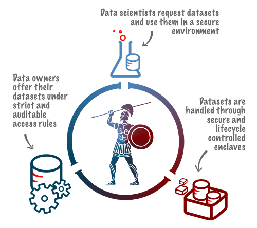

**Browse the doc at
[https://dedis.github.io/odyssey/](https://dedis.github.io/odyssey/), or
directly in [/docs](/docs)**

# odyssey

Auditable Sharing and Management of Sensitive Data Across Jurisdictions.

Odyssey is a set of applications and tools that enables the sharing sensitive
data between multiple distrustfull parties. This project uses state-of-the-art
secret management service [1] on the blockchain [2] coupled with an enclave
delivery mechanism. This uniq combination provides auditable access on shared
datasets, collective agreement, and controled life-cycle of the data that
prevents malicious or accidental leakage of data. At rest, data is stored
encrypted on a private cloud provider. Data can be requested and decrypted based
on the attributes of a project that clearly defines the context on wich the data
will be used. Those attributes are stored on the blockchain and the data is
released when a quorum of nodes agree that the attributes of the project comply
with the defined use of the data. The data is never decrypted outside a virtual
machine (VM) created on fly for that purpose. The lifecycle of the VM ensures
that unencrypted data is deleted after use, preventing accidental or malicious
leakage.

[1] [Calypso - Auditable Sharing of Private Data over Blockchains](https://eprint.iacr.org/2018/209)  
[2] [OmniLedger: A Secure, Scale-Out, Decentralized Ledger via Sharding](https://eprint.iacr.org/2017/406)

This repo holds all the components necessary to run the Odyssey projects. You
will find 3 components:

- **Data Scientist Manager**, user application that delivers requested datasets
  to an encalve
- **Data Owner Manager**, user application that allows one to upload and update
  datasets
- **Enclave Manager**, server application that handles the lifecycle of enclaves

  

Additionally, some tools were needed to support the system:

- **Projectc**, a smart contract holding the attributes of a project
- **Catalogc**, a smart contract holding the catalog of available datasets along
  with their attributes that control their acess
- **Cryptutil**, a command line tool to encrypt and decrypt data with AES-CGM
- **Enclave**, scripts used on the enclave (ie. VMs)

---

See the full documentation in
[https://dedis.github.io/odyssey/](https://dedis.github.io/odyssey/), or
directly in [/docs](/docs)