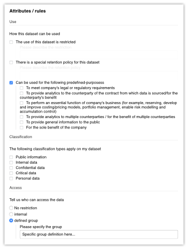

# Attributes

Attributes are what control access to datasets. A data owner sets attributes on
its datasets and a data scientist sets attributes on a project that requires the
use of some datasets (a project is an instance of the project smart contract).
The attributes of the project must comply with the attributes of the selected
datasets. For example, there might be an attribute of type "use" that defines
the authorized use of a dataset. Let's say a data owner uploads a dataset and
sets the following authorized uses:

Authorized uses for dataset X:
- [ ] authorized for use A
- [x] authorized for use B
- [ ] authorized for use C 

Then, if a data scientist requests "dataset X" in the context of "project Y"
with the following attributes:

Uses attributes on project Y:
- [ ] need authorized use A
- [x] need authorized use B
- [x] need authorized use C

The project wont be validated because the requested dataset X doesn't allow the
"use C".

The attributes can be described in json syntax, which is convenient to update
the catalog (the catalog is an instance of the catalog smart contract). The
attributes are split into two categories: "must_have" and "allowed". A
"must_have" attribute is an attribute that must be selected by the data
scientist to be accepted. In our previous example, the "use" attribute is of
type "allowed": if "use C" is allowed on a dataset that doesn't mean that a data
scientist must select "use C" to be accepted. An example of a "must_have"
attribute is an attribute that defines the accreditation needed to use a
dataset. If a dataset D has a "must_have" accreditation attribute
"confidential", then a data scientist that creates a project requesting dataset
D must have this accreditation and set it on the project's attributes for the
project to be accepted.

An attribute can have a "delegated_enforcement", which is necessary for
attributes that can not be automatically validated because there is a textual
description that a data scientist must read and agree on. Those textual
descriptions are written in a special "delegated_enforcement" section, where we
link delegated attributes and the textual description with their IDs.

Finally, we designed attributes to be recursively defined, ie. an attribute can
have multiple nested attributes, which can then have multiple nested attributes
and so on. This gives us a flexible way to define complex attributes structures.

## Definition

We used the following attributes definition in our demo. This definition is
applied on the catalog (ie. an instance of the catalog smart contract). See the
[catalog section](https://dedis.github.io/odyssey/#/domanager?id=catalog) of the
Data Owner Manager in order to set it on the catalog.

```json
{
	"attributesGroups": [{
			"title": "Use",
			"description": "How this dataset can be used",
			"consumer_description": "Please tell us how the result will be used",
			"attributes": [{
					"id": "use_restricted",
					"name": "use_restricted",
					"description": "The use of this dataset is restricted",
					"type": "checkbox",
					"rule_type": "must_have",
					"delegated_enforcement": true,
					"attributes": [{
						"id": "use_restricted_description",
						"name": "use_restricted_description",
						"description": "Please describe the restriction",
						"type": "text",
						"rule_type": "must_have",
						"delegated_enforcement": true,
						"attributes": []
					}]
				},
				{
					"id": "use_retention_policy",
					"name": "use_retention_policy",
					"description": "There is a special retention policy for this dataset",
					"type": "checkbox",
					"rule_type": "must_have",
					"delegated_enforcement": true, 
					"attributes": [{
						"id": "use_retention_policy_description",
						"name": "use_retention_policy_description",
						"description": "Please describe the retention policy",
						"type": "text",
						"rule_type": "must_have",
						"delegated_enforcement": true,
						"attributes": []
					}]
				},
				{
					"id": "use_predefined_purpose",
					"name": "use_predefined_purpose",
					"description": "Can be used for the following predefined-purposess",
					"consumer_description": "the result will be used for the following pre-defined purposes",
					"type": "checkbox",
					"rule_type": "allowed",
					"attributes": [{
						"id": "use_predefined_purpose_legal",
						"name": "use_predefined_purpose_legal",
						"description": "To meet company's legal or regulatory requirements",
						"type": "checkbox",
						"rule_type": "allowed",
						"attributes": []
					}, {
						"id": "use_predefined_purpose_analytics_counterparty",
						"name": "use_predefined_purpose_analytics_counterparty",
						"description": "To provide analytics to the counterparty of the contract from which data is sourced/for the counterparty's benefit",
						"type": "checkbox",
						"rule_type": "allowed",
						"attributes": []
					}, {
						"id": "use_predefined_purpose_essential",
						"name": "use_predefined_purpose_essential",
						"description": "To perform an essential function of company's business (for example, reserving, develop and improve costing/pricing models, portfolio management, enable risk modelling and accumulation control)",
						"type": "checkbox",
						"rule_type": "allowed",
						"attributes": []
					}, {
						"id": "use_predefined_purpose_analytics_multiple_counterparty",
						"name": "use_predefined_purpose_analytics_multiple_counterparty",
						"description": "To provide analytics to multiple counterparties / for the benefit of multiple counterparties",
						"type": "checkbox",
						"rule_type": "allowed",
						"attributes": []
					}, {
						"id": "use_predefined_purpose_general_information",
						"name": "use_predefined_purpose_general_information",
						"description": "To provide general information to the public",
						"type": "checkbox",
						"rule_type": "allowed",
						"attributes": []
					}, {
						"id": "use_predefined_purpose_sole_company",
						"name": "use_predefined_purpose_sole_company",
						"description": "For the sole benefit of the company",
						"type": "checkbox",
						"rule_type": "allowed",
						"attributes": []
					}]
				}
			]
		},
		{
			"title": "Classification",
			"description": "The following classification types apply on my dataset",
			"consumer_description": "I have the right to work with the following types of data",
			"attributes": [{
				"id": "classification_public",
				"name": "classification_public",
				"description": "Public information",
				"type": "checkbox",
				"rule_type": "must_have",
				"attributes": []
			}, {
				"id": "classification_internal",
				"name": "classification_internal",
				"description": "Internal data",
				"type": "checkbox",
				"rule_type": "must_have",
				"attributes": []
			}, {
				"id": "classification_confidential",
				"name": "classification_confidential",
				"description": "Confidential data",
				"type": "checkbox",
				"rule_type": "must_have",
				"attributes": []
			}, {
				"id": "classification_critical",
				"name": "classification_critical",
				"description": "Critical data",
				"type": "checkbox",
				"rule_type": "must_have",
				"attributes": []
			}, {
				"id": "classification_personal",
				"name": "classification_personal",
				"description": "Personal data",
				"type": "checkbox",
				"rule_type": "must_have",
				"attributes": []
			}]
		},
		{
			"title": "Access",
			"description": "Tell us who can access the data",
			"consumer_description": "Please select who will have access the the result",
			"attributes": [{
				"id": "access_unrestricted",
				"name": "access",
				"description": "No restriction",
				"type": "radio",
				"rule_type": "must_have",
				"attributes": []
			}, {
				"id": "access_internal",
				"name": "access",
				"description": "internal",
				"type": "radio",
				"rule_type": "must_have",
				"attributes": []
			}, {
				"id": "access_defined_group",
				"name": "access",
				"description": "defined group",
				"type": "radio",
				"rule_type": "must_have",
				"attributes": [{
					"id": "access_defined_group_description",
					"name": "access_defined_group_description",
					"description": "Please specify the group",
					"delegated_enforcement": true,
					"type": "text",
					"rule_type": "must_have"
				}]
			}]
		}
	],
	"delegated_enforcement": {
		"title": "Manual enforcement",
		"description": "some restriction can not be automatically checked. Therefore, you are requested to agree on the following attributes.",
		"attributes": [{
			"id": "use_restricted_description_enforcement",
			"description": "I agree on this restriction use",
			"value_from_id": "use_restricted_description",
			"trigger_id": "use_restricted",
			"trigger_value": "",
			"check_validates": [
				"use_restricted"
			],
			"text_validates": "use_restricted_description"
		},{
			"id": "use_retention_policy_description_enforcement",
			"description": "I agree on this retention policy",
			"value_from_id": "use_retention_policy_description",
			"trigger_id": "use_retention_policy",
			"trigger_value": "",
			"check_validates": [
				"use_retention_policy"
			],
			"text_validates": "use_retention_policy_description"
		},{
			"id": "access_defined_group_description_enforcement",
			"description": "I certify that the result will only be used by this specific group",
			"value_from_id": "access_defined_group_description",
			"trigger_id": "access_defined_group",
			"trigger_value": "",
			"text_validates": "access_defined_group_description"
		}]
	}
}
```

We then use this attributes definition to create an HTML form, which renders as
follow:

<div align="center">
	
</div>

## DARC

The Data Owner Manager automatically translates the attributes set on the
catalog to DARC definition on the "spawn:calypsoread" action of the
corresponding dataset. The Data Owner Manager uses the HTML form to update the
attributes of the corrseponding dataset and its DARC representation. Here is the
corresponding DARC definition of the attributes described in the previous
section:

```
Darc(data owner)
    spawn:calypsoread - 
		attr:allowed:
			use_restricted=checked&
			use_restricted_description_29e58702ba0524ef9eac162914016241f795137aef54a2670979e887925ed9fa=This+is+the+description+of+the+restriction&use_retention_policy=checked&
			use_retention_policy_description_29e58702ba0524ef9eac162914016241f795137aef54a2670979e887925ed9fa=This+is+the+retention+policy&classification_public=checked&
			classification_internal=checked&classification_confidential=checked&
			classification_critical=checked&classification_personal=checked&
			access_defined_group=checked&
			access_defined_group_description_29e58702ba0524ef9eac162914016241f795137aef54a2670979e887925ed9fa=This+is+the+specific+group+description&use_predefined_purpose=checked&
			use_predefined_purpose_legal=checked&use_predefined_purpose_analytics_counterparty=checked&use_predefined_purpose_essential=checked&
			use_predefined_purpose_analytics_multiple_counterparty=checked&
			use_predefined_purpose_general_information=checked&
			use_predefined_purpose_sole_company=checked&
		attr:must_have:
			use_restricted=checked&
			use_restricted_description_29e58702ba0524ef9eac162914016241f795137aef54a2670979e887925ed9fa=This+is+the+description+of+the+restriction&use_retention_policy=checked&
			use_retention_policy_description_29e58702ba0524ef9eac162914016241f795137aef54a2670979e887925ed9fa=This+is+the+retention+policy&
			classification_public=checked&
			classification_internal=checked&
			classification_confidential=checked&
			classification_critical=checked&
			classification_personal=checked&
			access_defined_group=checked&
			access_defined_group_description_29e58702ba0524ef9eac162914016241f795137aef54a2670979e887925ed9fa=This+is+the+specific+group+description
```

## Textual representation

For the record, here is the textual representation of an instance of those
attribures prints by the catalog:

```
- Metadata:
-- AttributesGroups:
--- AttributesGroups[0]:
---- AttributesGroup:
----- Title: Use
----- Description: How this dataset can be used
----- ConsumerDescription: Please tell us how the result will be used
----- Attributes:
------ Attributes[0]:
------- Attribute:
-------- ID: use_restricted
-------- Description: The use of this dataset is restricted
-------- Type: checkbox
-------- RuleType: must_have
-------- Name: use_restricted
-------- Value: 
-------- DelegatedEnforcement: true
-------- Attributes:
--------- Attributes[0]:
---------- Attribute:
----------- ID: use_restricted_description
----------- Description: Please describe the restriction
----------- Type: text
----------- RuleType: must_have
----------- Name: use_restricted_description
----------- Value: 
----------- DelegatedEnforcement: true
----------- Attributes:
------ Attributes[1]:
------- Attribute:
-------- ID: use_retention_policy
-------- Description: There is a special retention policy for this dataset
-------- Type: checkbox
-------- RuleType: must_have
-------- Name: use_retention_policy
-------- Value: 
-------- DelegatedEnforcement: true
-------- Attributes:
--------- Attributes[0]:
---------- Attribute:
----------- ID: use_retention_policy_description
----------- Description: Please describe the retention policy
----------- Type: text
----------- RuleType: must_have
----------- Name: use_retention_policy_description
----------- Value: 
----------- DelegatedEnforcement: true
----------- Attributes:
------ Attributes[2]:
------- Attribute:
-------- ID: use_predefined_purpose
-------- Description: Can be used for the following predefined-purposess
-------- Type: checkbox
-------- RuleType: allowed
-------- Name: use_predefined_purpose
-------- Value: checked
-------- DelegatedEnforcement: false
-------- Attributes:
--------- Attributes[0]:
---------- Attribute:
----------- ID: use_predefined_purpose_legal
----------- Description: To meet company's legal or regulatory requirements
----------- Type: checkbox
----------- RuleType: allowed
----------- Name: use_predefined_purpose_legal
----------- Value: checked
----------- DelegatedEnforcement: false
----------- Attributes:
--------- Attributes[1]:
---------- Attribute:
----------- ID: use_predefined_purpose_analytics_counterparty
----------- Description: To provide analytics to the counterparty of the contract from which data is sourced/for the counterparty's benefit
----------- Type: checkbox
----------- RuleType: allowed
----------- Name: use_predefined_purpose_analytics_counterparty
----------- Value: checked
----------- DelegatedEnforcement: false
----------- Attributes:
--------- Attributes[2]:
---------- Attribute:
----------- ID: use_predefined_purpose_essential
----------- Description: To perform an essential function of company's business (for example, reserving, develop and improve costing/pricing models, portfolio management, enable risk modelling and accumulation control)
----------- Type: checkbox
----------- RuleType: allowed
----------- Name: use_predefined_purpose_essential
----------- Value: 
----------- DelegatedEnforcement: false
----------- Attributes:
--------- Attributes[3]:
---------- Attribute:
----------- ID: use_predefined_purpose_analytics_multiple_counterparty
----------- Description: To provide analytics to multiple counterparties / for the benefit of multiple counterparties
----------- Type: checkbox
----------- RuleType: allowed
----------- Name: use_predefined_purpose_analytics_multiple_counterparty
----------- Value: 
----------- DelegatedEnforcement: false
----------- Attributes:
--------- Attributes[4]:
---------- Attribute:
----------- ID: use_predefined_purpose_general_information
----------- Description: To provide general information to the public
----------- Type: checkbox
----------- RuleType: allowed
----------- Name: use_predefined_purpose_general_information
----------- Value: 
----------- DelegatedEnforcement: false
----------- Attributes:
--------- Attributes[5]:
---------- Attribute:
----------- ID: use_predefined_purpose_sole_company
----------- Description: For the sole benefit of the company
----------- Type: checkbox
----------- RuleType: allowed
----------- Name: use_predefined_purpose_sole_company
----------- Value: 
----------- DelegatedEnforcement: false
----------- Attributes:
--- AttributesGroups[1]:
---- AttributesGroup:
----- Title: Classification
----- Description: The following classification types apply on my dataset
----- ConsumerDescription: I have the right to work with the following types of data
----- Attributes:
------ Attributes[0]:
------- Attribute:
-------- ID: classification_public
-------- Description: Public information
-------- Type: checkbox
-------- RuleType: must_have
-------- Name: classification_public
-------- Value: 
-------- DelegatedEnforcement: false
-------- Attributes:
------ Attributes[1]:
------- Attribute:
-------- ID: classification_internal
-------- Description: Internal data
-------- Type: checkbox
-------- RuleType: must_have
-------- Name: classification_internal
-------- Value: 
-------- DelegatedEnforcement: false
-------- Attributes:
------ Attributes[2]:
------- Attribute:
-------- ID: classification_confidential
-------- Description: Confidential data
-------- Type: checkbox
-------- RuleType: must_have
-------- Name: classification_confidential
-------- Value: 
-------- DelegatedEnforcement: false
-------- Attributes:
------ Attributes[3]:
------- Attribute:
-------- ID: classification_critical
-------- Description: Critical data
-------- Type: checkbox
-------- RuleType: must_have
-------- Name: classification_critical
-------- Value: 
-------- DelegatedEnforcement: false
-------- Attributes:
------ Attributes[4]:
------- Attribute:
-------- ID: classification_personal
-------- Description: Personal data
-------- Type: checkbox
-------- RuleType: must_have
-------- Name: classification_personal
-------- Value: 
-------- DelegatedEnforcement: false
-------- Attributes:
--- AttributesGroups[2]:
---- AttributesGroup:
----- Title: Access
----- Description: Tell us who can access the data
----- ConsumerDescription: Please select who will have access the the result
----- Attributes:
------ Attributes[0]:
------- Attribute:
-------- ID: access_unrestricted
-------- Description: No restriction
-------- Type: radio
-------- RuleType: must_have
-------- Name: access
-------- Value: 
-------- DelegatedEnforcement: false
-------- Attributes:
------ Attributes[1]:
------- Attribute:
-------- ID: access_internal
-------- Description: internal
-------- Type: radio
-------- RuleType: must_have
-------- Name: access
-------- Value: 
-------- DelegatedEnforcement: false
-------- Attributes:
------ Attributes[2]:
------- Attribute:
-------- ID: access_defined_group
-------- Description: defined group
-------- Type: radio
-------- RuleType: must_have
-------- Name: access
-------- Value: 
-------- DelegatedEnforcement: false
-------- Attributes:
--------- Attributes[0]:
---------- Attribute:
----------- ID: access_defined_group_description
----------- Description: Please specify the group
----------- Type: text
----------- RuleType: must_have
----------- Name: access_defined_group_description
----------- Value: 
----------- DelegatedEnforcement: true
----------- Attributes:
-- DelegatedEnforcement:
--- DelegatedEnforcement:
---- Description: some restriction can not be automatically checked. Therefore, you are requested to agree on the following attributes.
---- Attributes:
----- Attributes[0]:
------ EnforcementAttribute:
------- ID: use_restricted_description_enforcement
------- Description: I agree on this restriction use
------- ValueFromID: use_restricted_description
------- TriggerID: use_restricted
------- TriggerValue: 
------- CheckValidates: [use_restricted]
------- TextValidates: use_restricted_description
----- Attributes[1]:
------ EnforcementAttribute:
------- ID: use_retention_policy_description_enforcement
------- Description: I agree on this retention policy
------- ValueFromID: use_retention_policy_description
------- TriggerID: use_retention_policy
------- TriggerValue: 
------- CheckValidates: [use_retention_policy]
------- TextValidates: use_retention_policy_description
----- Attributes[2]:
------ EnforcementAttribute:
------- ID: access_defined_group_description_enforcement
------- Description: I certify that the result will only be used by this specific group
------- ValueFromID: access_defined_group_description
------- TriggerID: access_defined_group
------- TriggerValue: 
------- CheckValidates: []
------- TextValidates: access_defined_group_description
```