# Set up the cloud virtualization service

The Odyssey project used VMware cloud in order to spin of and manage the
lifecycle of vritual machine that we call "enclaves".

## Setup the Swisscom cloud with its first vApp

We used the [Swisscom Dynamic Compution
servive](https://www.swisscom.ch/en/business/enterprise/offer/cloud-data-center/dynamic-computing-services.html)
the the virtualization service. This server offers vMware vCloud, which allows
one to manage virtual machines on the cloud.

From https://extranet.swisscom.ch, select “Dynamic Computing”:

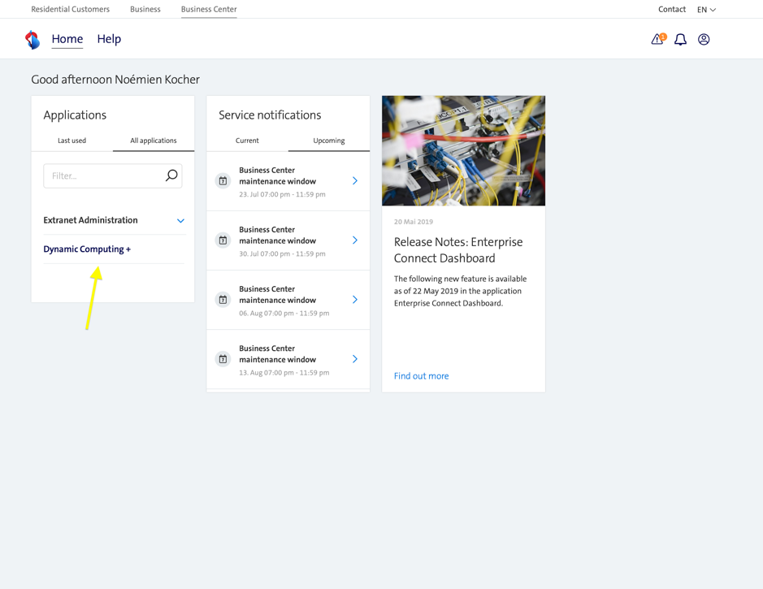

**Note**: It doesn’t work on Safari.

Select “Dynamic Data Center”:

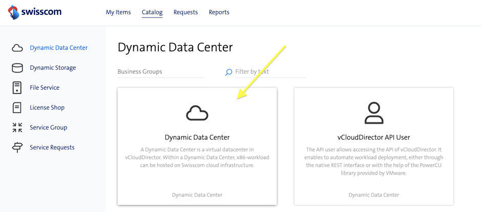

Create an Internet Access:

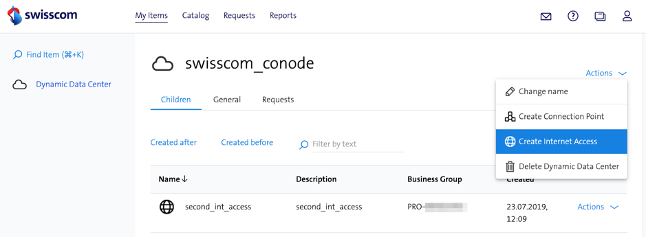

**Note**: Do not select “Edge Gateway”.

Then select “vCloud Director”:

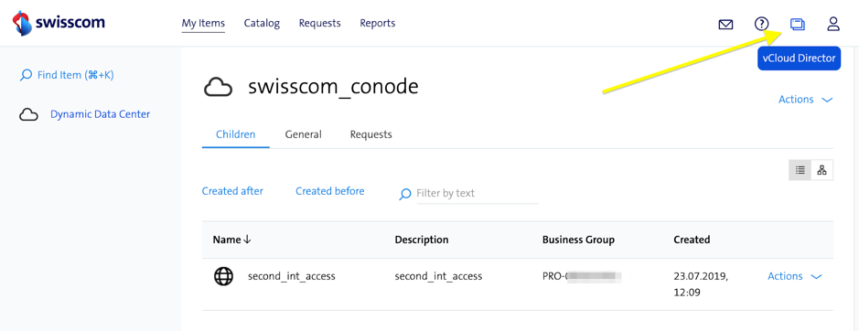

Select “vApps” > “New Vapp”:

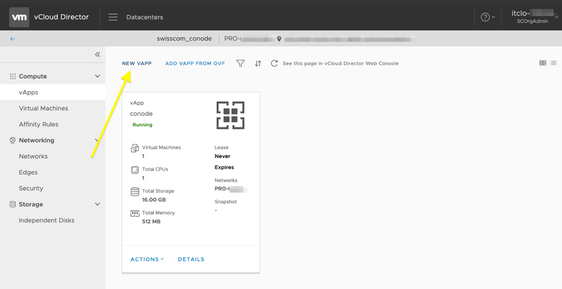

Then select “Add virtual Machine” and use “UBUNTU1804..”:

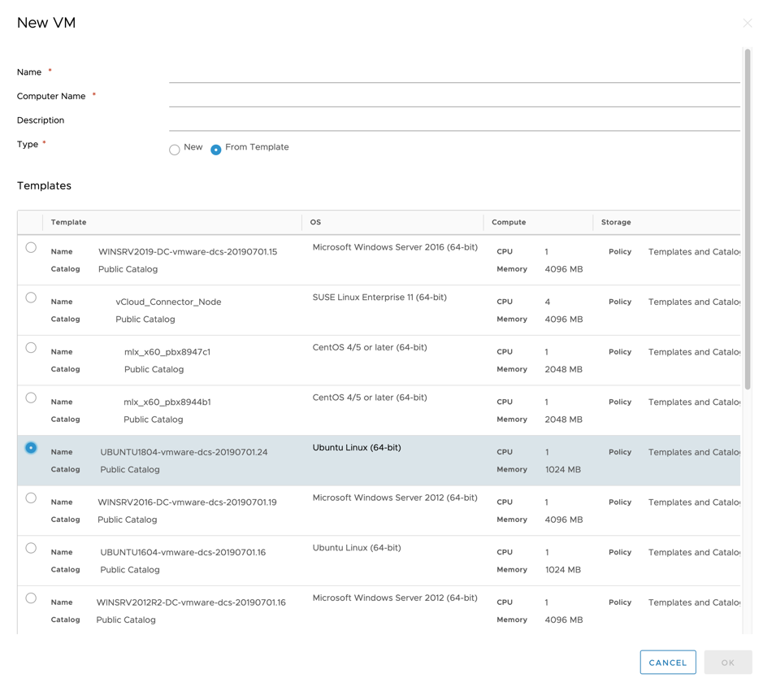

Once the vApp is created, select “Action” > “Add network” on the vApp:

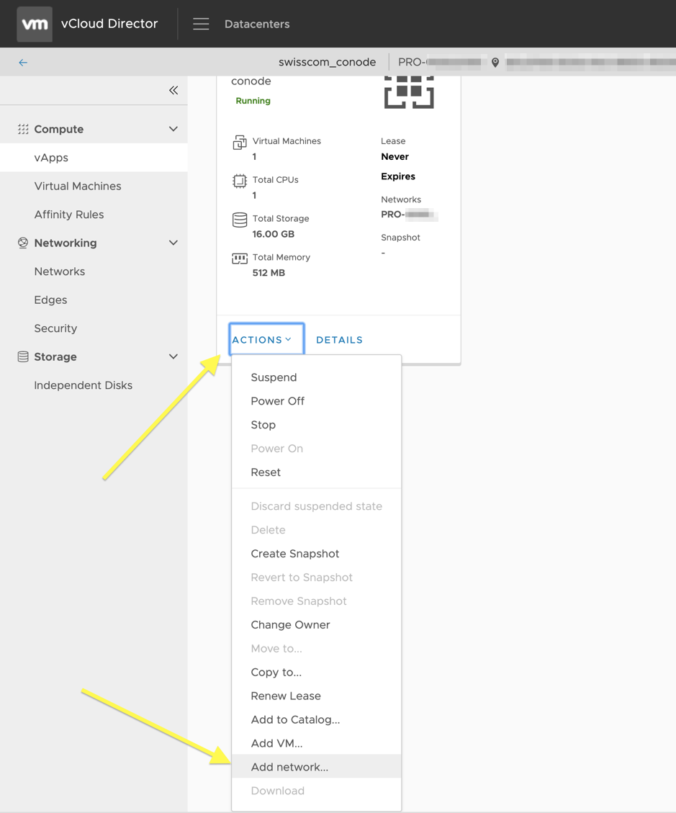

Then add the network created previously.

In “Virtual Machines”, select “Details”, then “Hardware” and add the network interface:

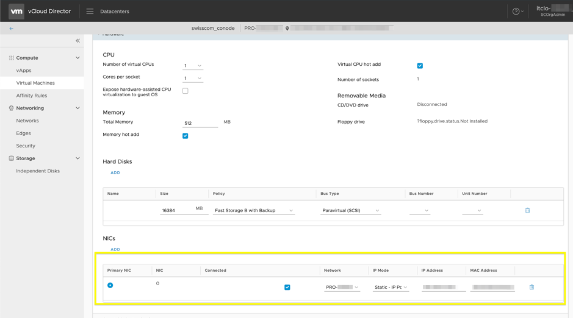

On the same page, on “Guest OS Customization” uncheck “Auto generate password” and specify a password: 

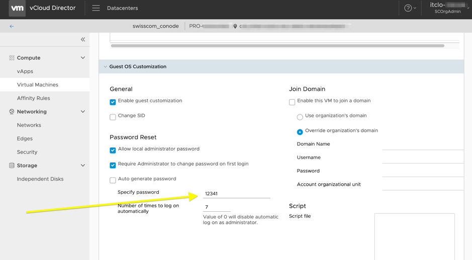

Then we are ready to start the VM, go to “Virtual Machines” > “Actions” > “Power on and Force Recustomization” (in this case it is already powered on):

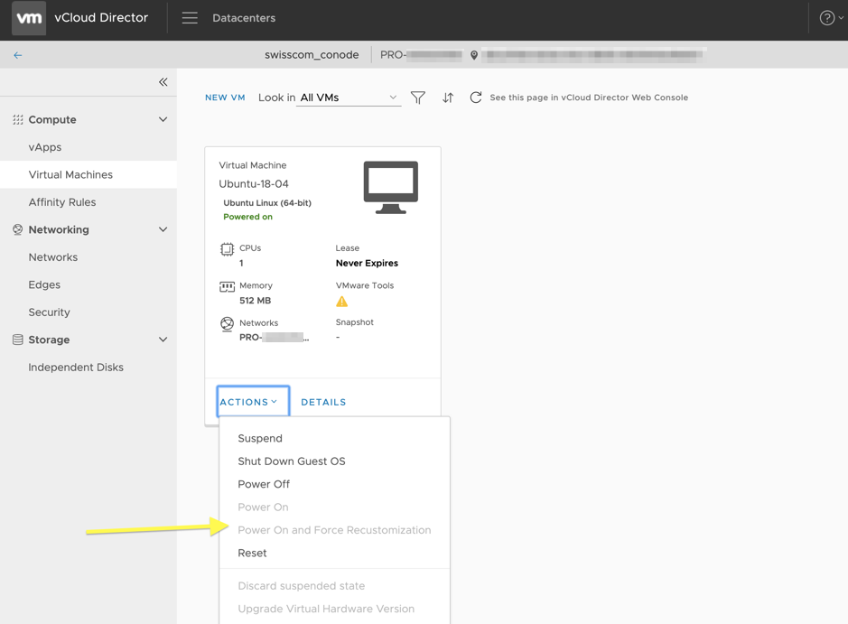

## Create a template

You first need to create a catalog that will contain your new template. This is
done by selecting "Librairies > Catalog > New":

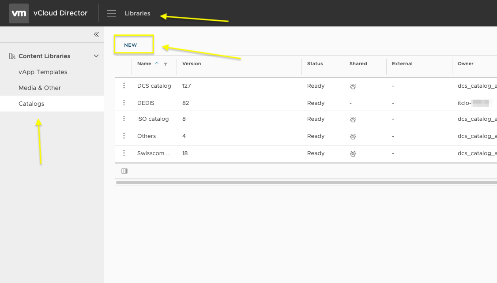

Then **be sure** that the vApp you want to use as a template doesn't any **any
network** attached to it. You can check it by selecting your vApp and checking
the "Network" section. This section MUST be empty:

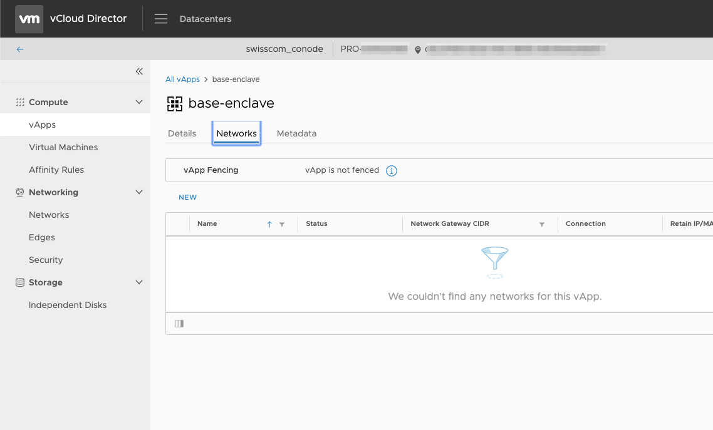

If the vApp template has already the network configured it will create some
conflicts and it will be impossible to instantiate a new vApp from the vApp
template. This is why the vApp template must not have any network configured.
Then, when a new vApp is instantiated from the vApp template, we can attach the
network to is and set “ip pool - manual” with one of the available ip.

For the record this is one of the weird error we got until we understood that
the network conflict was the problem:

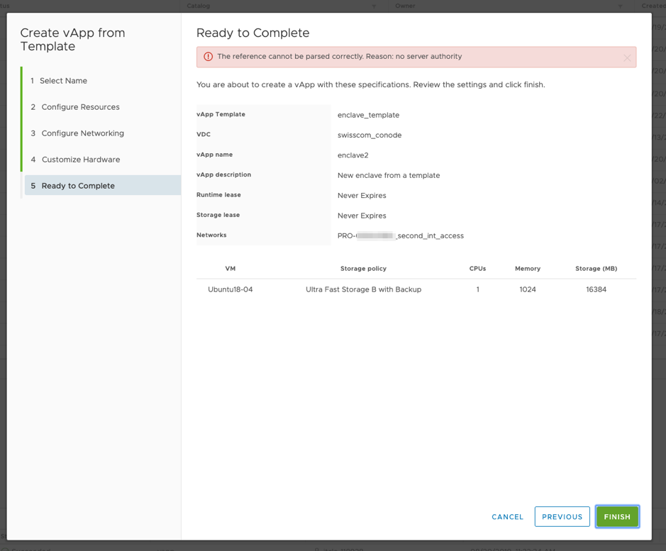

Once your vApp is ready to be used as a template, you can select "Add to
Catalog":

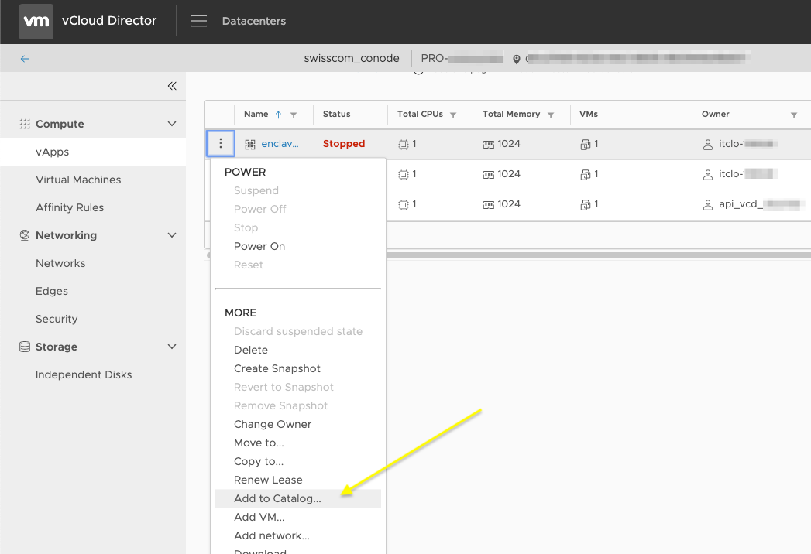

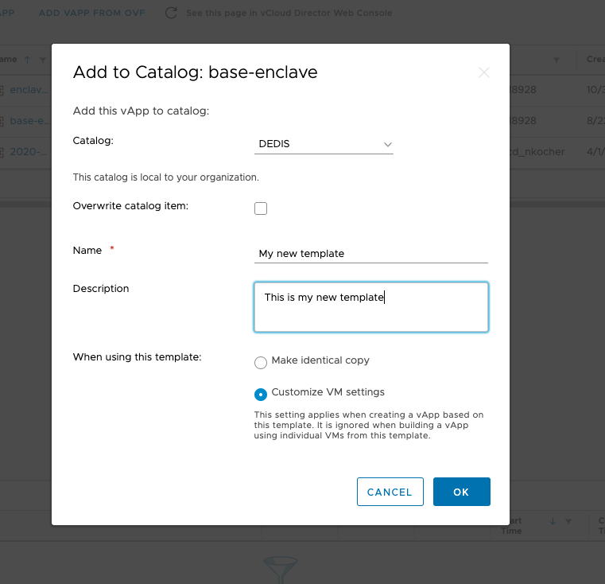

## Update a template

You can spawn a new vApp from the template and edit it using either the web
console, or you can ssh to it (in this case you need to attache a network to the
vApp). Once the changes are done, you must remove the network from the vApp and
overwrite the template with the new vApp:

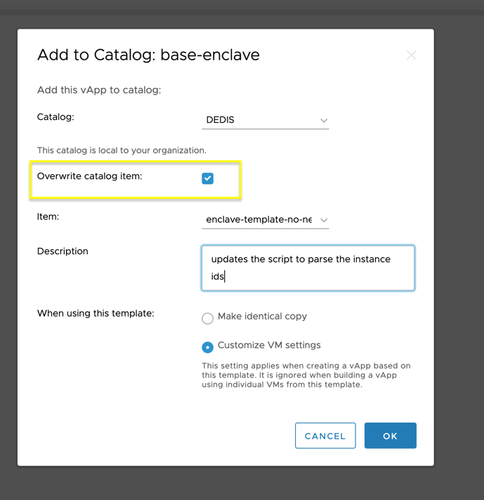

Also do not forget to restore the state of the vApp as is has never been used,
by calling the script in `enclave/clean.sh` for example.

Finally, since the template id has changed, you must save those changes in the
`secrect.sh` script. Take only the id part:

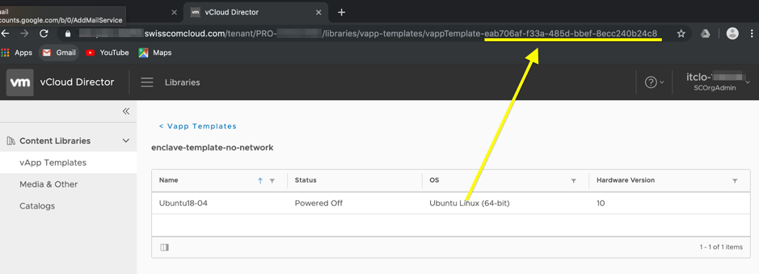

## Initial installation of the template

You can follow the next series of command to setup the enclave template. The
enclave template is a base ubuntu image that we copy when we initialize a new
enclave:

### Basic installation

```bash
# Update
sudo apt update
sudo apt upgrade

# Create a new "enclave" user
adduser enclave
usermod -aG sudo enclave
su enclave

# install git
sudo apt-get -y update
sudo apt-get install git

# install jq
# jq is used to escape string for json. Used by the startup script
wget https://github.com/stedolan/jq/releases/download/jq-1.6/jq-linux64

# download go
wget https://dl.google.com/go/go1.13.1.linux-amd64.tar.gz
tar -xvf go1.13.1.linux-amd64.tar

# install bcadmin and csadmin
cd /tmp
git clone https://github.com/dedis/cothority
cd cothority
git checkout tags/v3.4.4
# this will install the executables in ~/bin
GOPATH=~/ ~/go/bin/go install ./byzcoin/bcadmin
GOPATH=~/ ~/go/bin/go install ./calypso/csadmin

# install pcadmin and cryptutil
cd /tmp
git clone https://github.com/dedis/odyssey.git
cd odyssey
# this will install the executables in ~/bin
GOPATH=~/ ~/go/bin/go install ./projectc/pcadmin
GOPATH=~/ ~/go/bin/go install ./cryptutil

# The starup script expects the executable to be in the home directory
mv ~/bin/* ~/
```

### Firewall

```bash
# Only allow ssh connection and no other tcp/udp outbounds/inbounds
# one can use "sudo ufw disable" to temporarly download stuff.
sudo ufw disable
sudo ufw reset
sudo ufw default deny incoming
# needed for the logs and communication to cothority. This will be changed
# before the encalve is unlocked.
sudo ufw default allow outgoing
sudo ufw allow 22/tcp
sudo ufw enable
```

### Sientist user

The scientist user is the restricted user that will have access to the enclave.

```bash
# To add a non-login user, this is the user that we will give access to via ssh
sudo adduser scientist --disabled-password
#  --disabled-password: logins are still possible (for example using SSH RSA
#  keys) but not  using password authentication.

# Create the folder that will contain the datasets
cd /home/scientist/
sudo -u scientist mkdir -p python_project/datasets
# Since the 'enclave' user will have to get write access to this folder, we set
# the group with 7. The 'enclave' user will then be added in the 'scientist'
# group
sudo chmod 770 datasets
# Add the 'enclave' user to the 'scientist' group
sudo usermod -aG scientist enclave # may need to reload to take effect...
# Then copy the datasets
cp /home/enclave/datasets/* /home/scientist/datasets/

# create ssh stuff for the 'scientist' so that we can remotely connect via ssh
# using the provided RSA key.
cd /home/scientist
sudo -u scientist mkdir .ssh
sudo chmod 700 .ssh/
sudo -u scientist touch .ssh/authorized_keys
sudo chmod 600 .ssh/authorized_keys
# then add the public key

# install conda
CHECKSUM=46d762284d252e51cd58a8ca6c8adc9da2eadc82c342927b2f66ed011d1d8b53
wget -O /tmp/conda_installer.sh https://repo.anaconda.com/archive/Anaconda3-2019.10-Linux-x86_64.sh
echo "$CHECKSUM /tmp/conda_installer.sh" | sha256sum -c -
> check if its ok
chmod +x /tmp/conda_installer.sh 
sudo -u scientist /tmp/conda_installer.sh -b -p /home/scientist/python_project/anaconda3
sudo vim /home/scientist/.bashrc
> add the following at the TOP: export PATH=/home/scientist/python_project/anaconda3/bin:$PATH
# install geopandas for the scientist
sudo -u scientist /home/scientist/python_project/anaconda3/bin/conda install geopandas
```

### Custom scp

In our demo we show how to alleviate the problem of letting the user use scp to
copy datasets out of the enclave by using a custom version of scp. This simple
modification demonstrates of additional checks can be implemented.

The patch is available in `encalve/pii.patch`.

```bash
# Instructions to build custom scp
# Copy over the patch to /tmp/pii.patch
# Ensure you have the dependencies installed:
sudo apt-get update
sudo apt install build-essential libssl-dev zlib1g-dev
# Get OpenSSH source code from i.e. https://cdn.openbsd.org/pub/OpenBSD/OpenSSH/portable/
wget https://cdn.openbsd.org/pub/OpenBSD/OpenSSH/portable/openssh-8.1p1.tar.gz
tar zxvf openssh-8.1p1.tar.gz
cd openssh-8.1p1
patch -p1 < /tmp/pii.patch
sh configure
make scp
sudo cp ./scp /usr/bin/
```

### Set up the startup script

You can find the startup script in `enclave/startup.sh`. This script should be
always launched when the encalve (vApp) boots. This can be done by adding the
following lines in `/etc/rc.local`:

```bash
# Execute the startup script at boot
# add the following line in /etc/rc.local
/home/enclave/startup.sh >> /home/enclave/rclogs.log 2>&1
```

### Note on the startup

We found out that the startup script can be launched two times at startup, the
first time very brielfy so it only executes few instruction before starting
again. We don't know exactly why, but you should be aware of that.