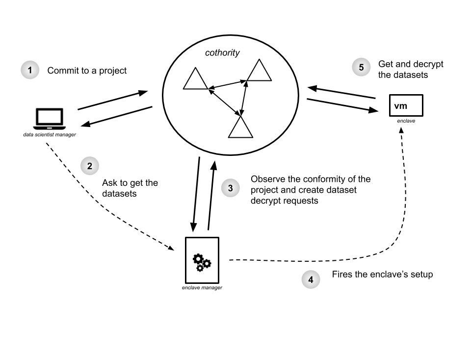
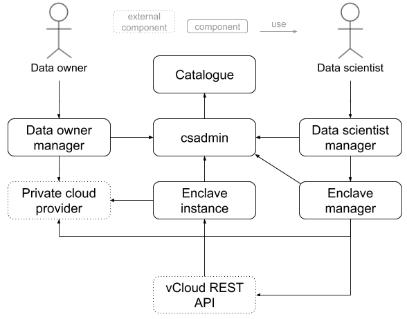
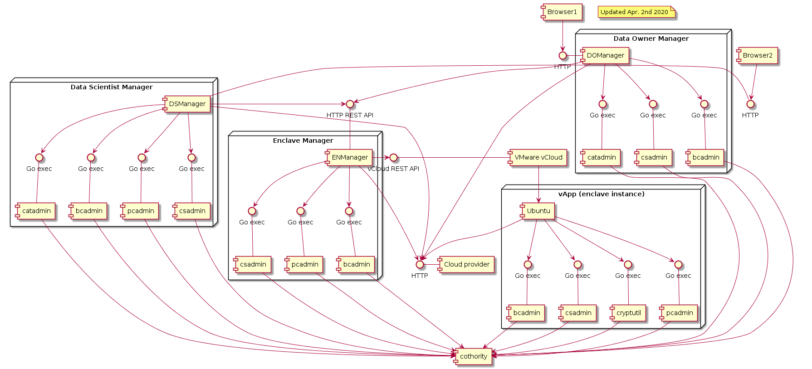

# Design

## Figures

**Logical view, cothority centric**

**Logical view, components' interactions**

**UML component diagram**

# About the DARCs

In order to later display the content of each DARC, the following table sets the
vocabulary of each identites and DARCs:

| Entity | DARC | Identity |
| ------ | ---- | -------- |
| 🔬 Data scientist | `darc(🔬)` | `id(🔬)` |
| 🐙 Enclave manager | `darc(🐙)` | `id(🐙)` |
| 👔 Data owner | `darc(👔)` | `id(👔)` |
| 📦 Dataset | `darc(📦)` | - |
| 🔐 Enclave | - | `id(🔐)` |

## darc(🔬) - Data scientist

Rational: The data scientist is responsible for creating the project instance
and setting the attributes on it. However, only the enclave manager has the
control over the DARC and can set the URL and public key of the enclave.

| Action | Rule | 
| ------ | ---- |
| `invoke:darc.evolve` | `id(🐙)` |
| `invoke:darc.evolve_unrestricted` | `id(🐙)` |
| `spawn:odysseyproject` | `id(🔬)` |
| `invoke:odysseyproject.update` | `id(🔬)` |
| `invoke:odysseyproject.updateStatus` | `id(🔬) \| id(🐙)` |
| `invoke:odysseyproject.setURL` | `id(🐙)` |
| `invoke:odysseyproject.setEnclavePubKey` | `id(🐙)` | 

## darc(🐙) - Enclave manager

Rational: The enclave manager doesn't need a DARC with a lot of rules on it
because it creates itself the other DARCs and can then ensure it has the correct
rights on them. For example, it creates the DARC for each dataset and ensure it
can create a read request.

| Action | Rule | 
| ------ | ---- |
| `spawn:darc` | `id(🐙)` |
| `invoke:darc.evolve` | `id(🐙)` |
| `invoke:darc.evolve_unrestricted` | `id(🐙)` |
| `spawn:odysseycatalog` | `id(🐙)` |
| `invoke:odysseycatalog.addOwner` | `id(🐙)` |

## darc(👔) - Data owner

Rational: The data owner's DARC mainly servers as an identity proxy. It is
convenient because it allows a data owner to update its identity and still get
access to its datasets. To do this it only needs to update the `_sign` action
(Note: the `_sign` actions are omited because they always have the default rule
on them, which is the identity of the entity that owns the DARC).

| Action | Rule | 
| ------ | ---- |
| `invoke:darc.evolve` | `id(👔)` |

## darc(📦) - Dataset

Rational: The data owner is able to create a write and read request, while the
enclave manager can create a read request provided it has the right project's
attributes.

| Action | Rule | 
| ------ | ---- |
| `invoke:darc.evolve` | `darc(👔) \| id(🐙)` |
| `invoke:darc.evolve_unrestricted` | `id(🐙)` |
| `spawn:calypsoWrite` | `darc(👔)` |
| `spawn:calypsoRead` | `darc(👔) \| (id(🐙) & attr:<custom_attributes>)` |

## id(🔐) - Enclave

The enclave's ID is not directly used in DARCs because it is only needed by the
enclave manager to create the read request.