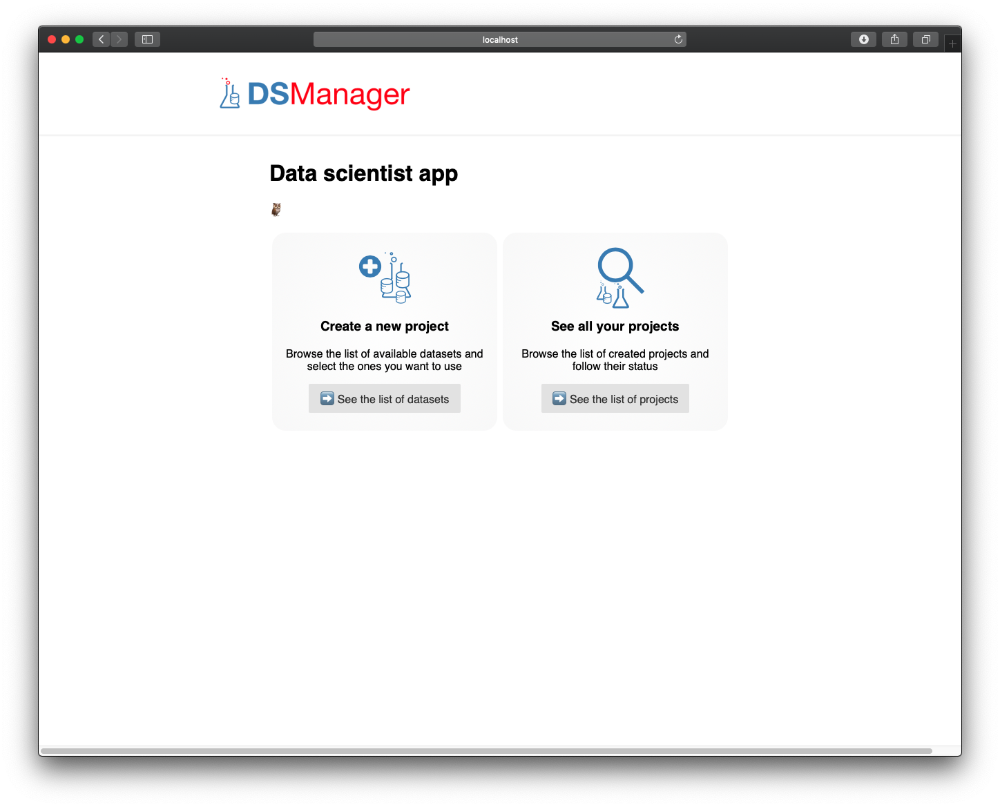
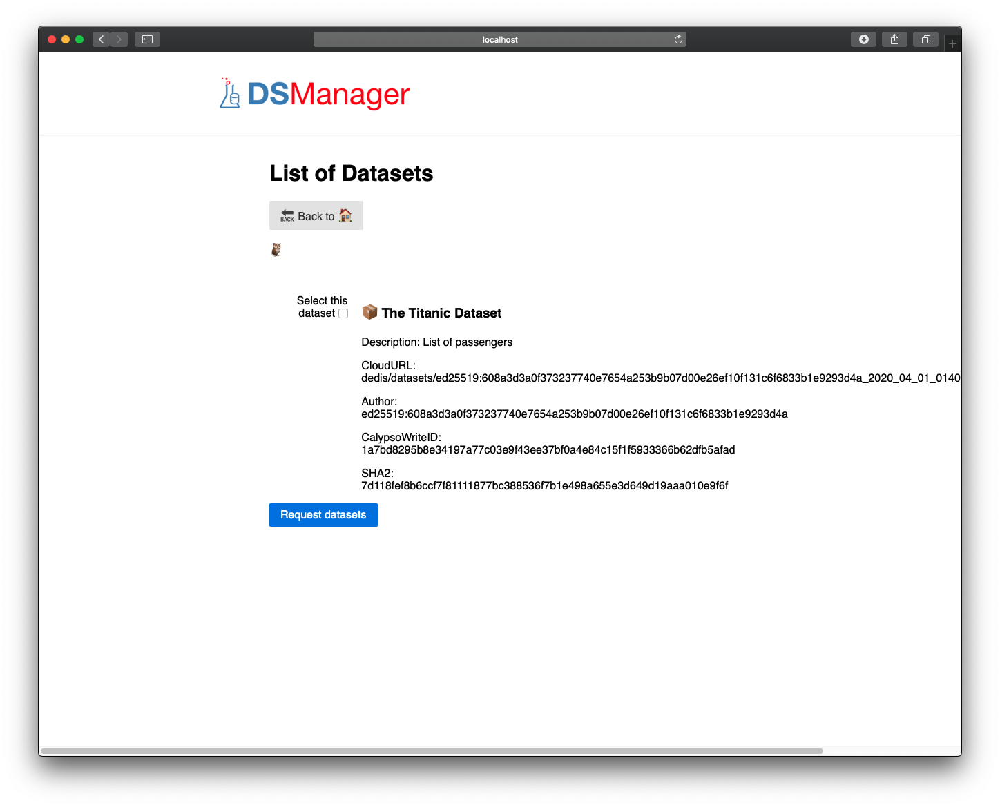
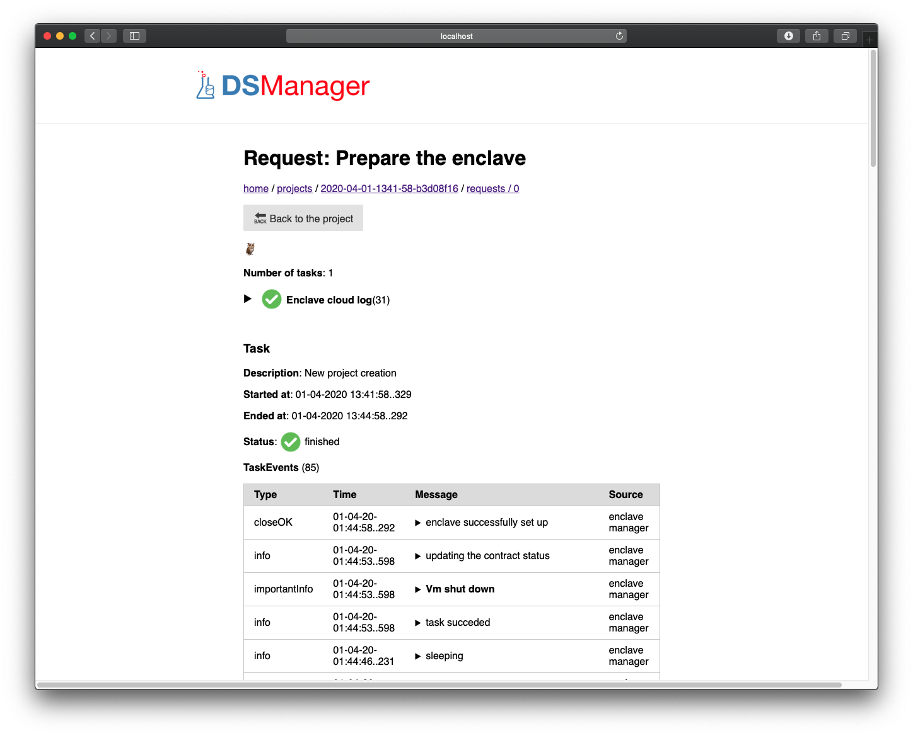
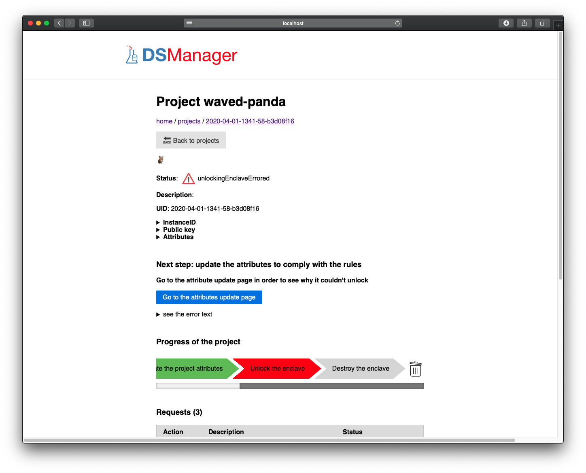
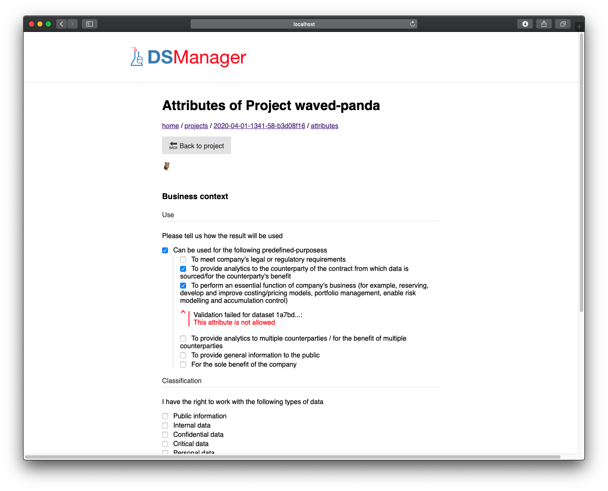
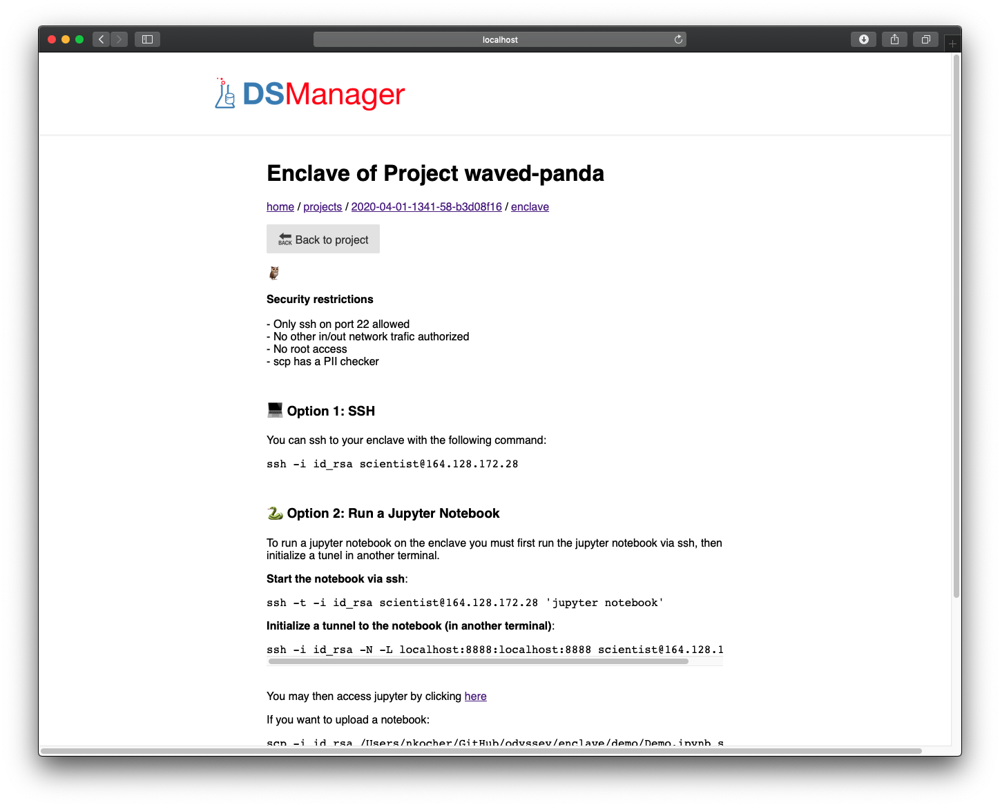

# Auditable Sharing and Management of Sensitive Data Across Jurisdictions

Because sharing sensitive data between multiple distrustfull parties can
be a challenge, Odyssey make use of state-of-the-art secret management
service on the blockchain, coupled with an enclave delivery mechanism,
to ensure controlled and safe delivery of the data, as well as proper
destruction of the data with a controlled life-cycle. At rest, data is
stored encrypted on a private cloud provider. Data can be requested and
decrypted based on the attributes of a project that clearly defines the
context on wich the data will be used. Data is never decrypted outside a
virtual machine (VM) created on fly for that purpose. The lifecycle of
the VM ensures that unencrypted data is deleted after use, preventing
accidental or malicious leakage.

This repo holds all the components necessary to run the Odyssey
projects. You will find 3 components:

- **Data Scientist Manager**, user application that delivers requested datasets to an encalve
- **Data Owner Manager**, user application that allows one to upload and update datasets
- **Enclave Manager**, server application that handles the lifecycle of enclaves

Additionally, some tools were needed to support the system:

- **Projectc**, a smart contract holding the attributes of a project
- **Catalogc**, a smart contract holding the catalog of available
  datasets along with their attributes that control their acess
- **Cryptutil**, a command line tool to encrypt and decrypt data with AES-CGM
- **Enclave**, scripts used on the enclave (ie. VMs)

## Screenshots

### Data Owner Manager (upload and management of datasets)

<figure>
    <figcaption>Welcome page</figcaption>
    
</figure>

<figure>
    <figcaption>Upload of a dataset</figcaption>
    
</figure>

<figure>
    <figcaption>Task created to upload a dataset</figcaption>
    
</figure>

<figure>
    <figcaption>List of datasets</figcaption>
    
</figure>

<figure>
    <figcaption>Edition of dataset: General infos</figcaption>
    
</figure>

<figure>
    <figcaption>Edition of dataset: Attributes</figcaption>
    
</figure>

<figure>
    <figcaption>Edition of dataset: Special actions and DARC</figcaption>
    
</figure>

<figure>
    <figcaption>Audit of a dataset access</figcaption>
    
</figure>

<figure>
    <figcaption>Lifecycle of a project</figcaption>
    
</figure>

<figure>
    <figcaption>Lifecycle of a project (enclave destruction)</figcaption>
    
</figure>

### Data Scientist Manager (use of datasets on enclaves)

<figure>
    <figcaption>Welcome page</figcaption>
    
</figure>

<figure>
    <figcaption>Project creation: selection of a dataset</figcaption>
    
</figure>

<figure>
    <figcaption>Project page</figcaption>
    
</figure>

<figure>
    <figcaption>Request to create the project: enclave initialization</figcaption>
    
</figure>

<figure>
    <figcaption>A failed attempty to unlock the enclave</figcaption>
    
</figure>

<figure>
    <figcaption>Attribute update on a project after a failed attempt</figcaption>
    
</figure>

<figure>
    <figcaption>Access page of the enclave (after successful unlock)</figcaption>
    
</figure>

