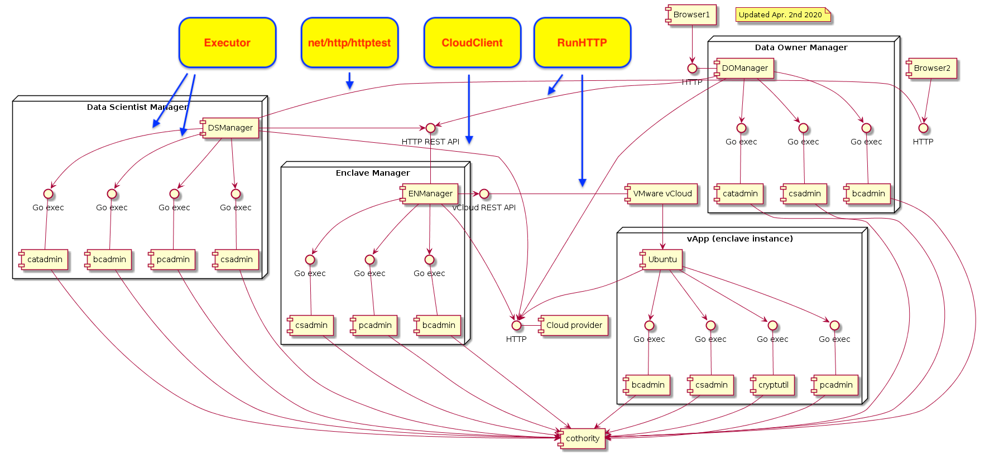

# Tests

The system is only at an early maturity stage in term of testing. Some efforts
have been invested in preparing the ground for testing. Therefore, the DOManager
has a first batch of tests that demonstrates how to mock the http server, the
commands performed with os.exec, the external cloud provider and the task
manager. It is a good start to develop more tests across the system. Some other
elements like the catalog smart contract have been well tested.

A first batch of tests have been added in the DSManager. It uses the same
mocking interfaces as the DOManager and adds a new one to mock the calls to the
Enclave Manager. The Enclave manager has also a first batch of testing that
demonstrates how to mock all its external components.

Rating:  
0 = Not tested  
1 = Barely tested  
2 = Mostly tested  
3 = Fully tested  

| Module | Testing level | Remarks |
|--------|---------------|--------|
| Catalogc | 🌕🌕🌗 2.5  | catadmin not tested |
| Cryptutil | 🌕🌕🌕 3 | |
| DOManager | 🌕🌗🌑 1.5 | can be used as a base for the test in DSManager |
| DSManager | 🌕 1 | |
| Enclavem | 🌕 1 | |
| Enclave | 0 | |
| Projectc | 🌕🌕🌗 2.5  | pcadmin not tested |

You can launch all the tests with:

```make
make test
```

## Components

Decoupling our system with clear interfaces and components gave us a nice ground
for testing. Most of the interfaces needed to mock the different components are
available in `dsmanager/app/helpers`.

The following illustration shows the different interfaces required to mock the
components:



Note that our system does not yet use all the interfaces it should. For example
there is still a lot of direct calls with `os/exec` instead of
`conf.Executor.Run`. This should be eventually done with the implementations of
new tests.

## Where to continue

One good start is `domanager/app/main_test.go`. One would want to extend the
tests adding more cases (with the update of a dataset for example), and then
break `main_test.go` where each test is close to its location: for example
moving the tests releated to the datasets controller in a new
`controllers/datasets_test.go` file.